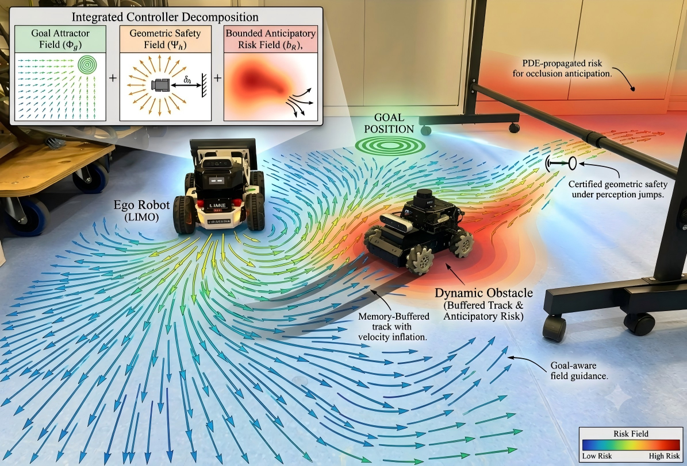

# limo_nav

ROS 2 Humble navigation experiments for AgileX LIMO platforms.



This package contains two related planners:

- `potential_field_wander`: a conservative potential-field wanderer with optional RViz goal mode.
- `safe_vf`: a goal-directed safe vector-field controller with baseline modes, CBF-style safety filtering, short-horizon risk memory, and RViz field markers.

The package is intentionally independent of a specific LIMO bringup package. It only requires standard ROS topics and frames from the robot platform.

## Platform Requirements

Tested target:

- AgileX LIMO running ROS 2 Humble
- Ubuntu 22.04
- `rclpy`
- `sensor_msgs/msg/LaserScan`
- `geometry_msgs/msg/Twist`
- `nav_msgs/msg/Odometry`
- `visualization_msgs/msg/MarkerArray`
- `tf2_ros`
- `rviz2`

Required runtime interfaces:

| Interface | Default | Notes |
| --- | --- | --- |
| LaserScan | `/scan` | LiDAR input. RViz should use Best Effort QoS for many YDLidar drivers. |
| Velocity command | `/cmd_vel` | Only published when `publish_cmd_vel:=true`. |
| Odometry | `/wheel/odom` | Override with `odom_topic:=/odom` if your platform uses `/odom`. |
| Goal pose | `/goal_pose` | RViz 2D Goal Pose topic. |
| Base frame | `base_link` | Robot body frame. |
| Odom frame | `odom` | Fixed frame for RViz and goal transforms. |

Before enabling motion, verify that teleop, emergency stop, LiDAR, odometry, TF, and `/cmd_vel` are working on the target robot.

## Installation From GitHub

Choose the workspace used by your LIMO platform. On the current robot either `~/agilex_ws` or `~/limo_lvv_ws` can be used. The package does not require editing existing bringup files.

```bash
# Example workspace. Change this to your robot workspace if needed.
export LIMO_WS=~/agilex_ws

mkdir -p $LIMO_WS/src
cd $LIMO_WS/src

# Replace this URL with the GitHub repository URL that contains this package.
git clone https://github.com/<your-org>/limo_nav.git

cd $LIMO_WS
source /opt/ros/humble/setup.bash
rosdep update
rosdep install --from-paths src --ignore-src -r -y
colcon build --packages-select limo_nav --symlink-install
source install/setup.bash
```

If the package is stored inside a larger repository, clone that repository into `src` and build the `limo_nav` package the same way.

## Quick Platform Check

Run these commands after starting the normal LIMO bringup:

```bash
source /opt/ros/humble/setup.bash
source $LIMO_WS/install/setup.bash

ros2 topic list
ros2 topic echo /scan --once
ros2 topic echo /wheel/odom --once
ros2 topic info /cmd_vel
ros2 run tf2_ros tf2_echo odom base_link
```

If your odometry topic is `/odom`, use that instead of `/wheel/odom`.

On the current onboard structure, the robot bringup is:

```bash
source ~/limo_lvv_ws/install/setup.bash
ros2 launch my_bringup limo_start.launch.py
```

Other LIMO platforms may use a vendor bringup launch file. That is fine as long as the required topics and TF tree exist.

## Safety Defaults

Both launch files default to dry-run mode:

```bash
publish_cmd_vel:=false
```

This means the planner computes fields and publishes visualization, but does not command the robot.

Initial real-robot limits:

```text
linear.x <= 0.15 m/s
abs(angular.z) <= 0.5 rad/s
```

Additional safety behavior:

- Stale LaserScan data causes zero velocity.
- Stale odometry in `safe_vf` causes zero velocity.
- Invalid scan values are ignored: NaN, inf, zero, and out-of-range values.
- Close frontal obstacles stop or strongly suppress forward motion.
- `safe_vf` waits for an RViz goal by default.

Use wheels lifted or a large open area for first motion tests.

## Planner 1: Potential-Field Wanderer

The basic planner computes:

```text
final_vector = attractive_vector + repulsive_vector
```

Attraction:

- In `wander` mode, the attraction vector points forward in `base_link`.
- In `goal` mode, the attraction vector points toward the RViz goal.

Repulsion:

- LiDAR beams within `repulsion_distance` create repulsive vectors.
- The repulsive force grows as obstacles get closer.

Command mapping:

- `linear.x` is derived from forward vector strength.
- `angular.z` is derived from `atan2(y_final, x_final)`.

Dry-run with RViz:

```bash
source $LIMO_WS/install/setup.bash
ros2 launch limo_nav potential_field_wander.launch.py use_rviz:=true
```

Goal mode dry-run:

```bash
ros2 launch limo_nav potential_field_wander.launch.py \
  planner_mode:=goal \
  use_rviz:=true
```

Enable motion only after checks pass:

```bash
ros2 launch limo_nav potential_field_wander.launch.py \
  planner_mode:=goal \
  publish_cmd_vel:=true \
  use_rviz:=true
```

Topic overrides:

```bash
ros2 launch limo_nav potential_field_wander.launch.py \
  scan_topic:=/scan \
  cmd_vel_topic:=/cmd_vel \
  goal_topic:=/goal_pose \
  max_linear_speed:=0.15 \
  max_angular_speed:=0.5
```

RViz vector topics:

```text
/attraction_vector
/repulsion_vector
/final_vector
```

## Planner 2: Safe Vector Field With Risk Terms

The safe vector-field node extends the potential-field idea into selectable baseline and risk-aware modes.

Launch file:

```bash
ros2 launch limo_nav safe_vf.launch.py
```

Available modes:

| Mode | Meaning |
| --- | --- |
| `goal_only` | Pure attractive vector to the goal. No obstacle avoidance baseline. |
| `apf` | Classical artificial potential field with LiDAR repulsion. |
| `cbf` | Goal vector filtered by a smooth CBF-compatible safety barrier. |
| `mpc` | Lightweight local one-step command selection baseline. |
| `safe_vf` | Geometry-aware safe vector field using obstacle constraints. |
| `safe_vf_prior` | Safe vector field plus short-horizon prior/risk memory. |
| `pde_risk` | Safe vector field plus propagated scan-memory risk-gradient approximation. |

Notebook-style aliases are also accepted internally, including:

```text
GOAL_ONLY_VECTOR
PURE_APF_BUFFER
PURE_CBF_FILTER
PURE_MPC_LOCAL
SAFE_VF_BUFFER_ONLY
SAFE_VF_BUFFER_PLUS_PRIOR_RISK
BUFFER_PLUS_PDE_RISK
```

Dry-run with RViz:

```bash
source $LIMO_WS/install/setup.bash
ros2 launch limo_nav safe_vf.launch.py \
  mode:=safe_vf_prior \
  use_rviz:=true
```

Run the propagated risk approximation:

```bash
ros2 launch limo_nav safe_vf.launch.py \
  mode:=pde_risk \
  use_rviz:=true
```

Enable motion only after checks pass:

```bash
ros2 launch limo_nav safe_vf.launch.py \
  mode:=safe_vf_prior \
  publish_cmd_vel:=true \
  use_rviz:=true
```

If your LIMO publishes odometry on `/odom`:

```bash
ros2 launch limo_nav safe_vf.launch.py \
  mode:=safe_vf_prior \
  odom_topic:=/odom \
  publish_cmd_vel:=true \
  use_rviz:=true
```

## RViz Visualization

For the potential-field wanderer, use:

```text
/attraction_vector
/repulsion_vector
/final_vector
```

For the safe vector-field planner, add a `MarkerArray` display:

```text
/safe_vf/field_markers
```

The marker namespaces are separated so they can be toggled independently:

```text
attractive_force
repulsive_force
geometry_field
risk_field
raw_command_field
realized_velocity
```

Use `odom` as the RViz fixed frame. If the LiDAR scan does not appear, set the LaserScan display QoS reliability to `Best Effort`.

## Field Theory Incorporated

### Attractive Field

The attractive term points from the robot toward either:

- a fixed forward direction for wandering, or
- the RViz-selected goal pose for goal navigation.

Conceptually:

```text
F_goal = k_goal * unit(goal - robot)
```

### Repulsive Field

Each valid LiDAR return inside the obstacle influence radius contributes a repulsive term away from the obstacle.

Conceptually:

```text
F_rep += eta * (1/r - 1/r0) / r^2 * direction_away
```

where `r` is obstacle range and `r0` is the influence distance.

### Smooth Barrier / CBF-Compatible Filtering

The `cbf`, `safe_vf`, `safe_vf_prior`, and `pde_risk` modes suppress commands that point into unsafe nearby obstacle geometry. The implementation is compatible with the control-barrier-function idea:

```text
h(x) = distance_to_obstacle - safe_distance
```

Commands are reduced or redirected when `h(x)` becomes small.

### Risk Memory / Propagated Risk Field

The risk-aware modes keep a short memory of recent scan points and compute a local risk-gradient term. This helps avoid areas that were recently observed as risky even when a single scan frame is sparse or noisy.

A full PDE solver would add an explicit local risk grid and update it every control tick:

```text
dR/dt = diffusion + source - decay + optional advection
```

That extension requires stable obstacle tracks or velocity estimates. Raw LaserScan is sufficient for local repulsion, but obstacle-tracking is needed for a stronger PDE propagation model.

## Baseline Experiments

Run local baseline simulations without commanding the robot:

```bash
source $LIMO_WS/install/setup.bash
ros2 run limo_nav safe_vf_baselines --seeds 3 --out /tmp/limo_safe_vf_baselines.csv
```

Run selected modes:

```bash
ros2 run limo_nav safe_vf_baselines \
  --modes goal_only,apf,cbf,mpc,safe_vf,safe_vf_prior,pde_risk \
  --seeds 10 \
  --out /tmp/limo_safe_vf_baselines.csv
```

The baseline script reports reach rate, collision rate, path length, and minimum clearance for the local simulated obstacle set.

## Recommended Test Sequence

Use three terminals.

Terminal 1, robot bringup:

```bash
source /opt/ros/humble/setup.bash
source $LIMO_WS/install/setup.bash

# Use your platform bringup. Current onboard example:
ros2 launch my_bringup limo_start.launch.py
```

Terminal 2, verify platform graph:

```bash
source /opt/ros/humble/setup.bash
source $LIMO_WS/install/setup.bash

ros2 topic echo /scan --once
ros2 topic echo /wheel/odom --once
ros2 run tf2_ros tf2_echo odom base_link
```

Terminal 3, dry-run planner:

```bash
source /opt/ros/humble/setup.bash
source $LIMO_WS/install/setup.bash

ros2 launch limo_nav safe_vf.launch.py \
  mode:=safe_vf_prior \
  use_rviz:=true
```

In RViz:

1. Set fixed frame to `odom`.
2. Confirm the robot model moves with odometry.
3. Confirm `/scan` appears.
4. Add or inspect `/safe_vf/field_markers`.
5. Use `2D Goal Pose` to send a goal.

Only then enable real motion:

```bash
ros2 launch limo_nav safe_vf.launch.py \
  mode:=safe_vf_prior \
  publish_cmd_vel:=true \
  use_rviz:=true
```

## Common Problems

No robot model in RViz:

```bash
ros2 run tf2_ros tf2_echo odom base_link
```

If TF is missing, fix the robot bringup first.

No LiDAR in RViz:

- Check `ros2 topic echo /scan --once`.
- In RViz, set LaserScan QoS reliability to `Best Effort`.
- Confirm the scan frame has a TF path to `odom`.

Robot does not move:

- Confirm `publish_cmd_vel:=true`.
- Confirm the platform subscribes to the selected command topic:

```bash
ros2 topic info /cmd_vel
```

- Confirm no emergency stop or hardware safety lock is active.
- Confirm `safe_vf` has received a goal if `wait_for_goal` is true.

Odometry topic mismatch:

```bash
ros2 topic list | grep odom
```

Then relaunch with:

```bash
odom_topic:=/odom
```

